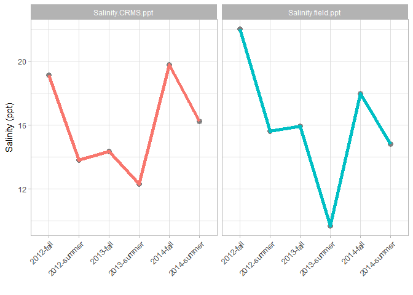
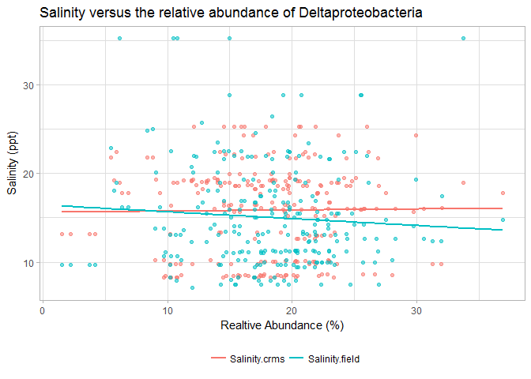

# Task_06 Brandon Bagley
#Introduction
This is an [R Markdown](http://rmarkdown.rstudio.com) Notebook presenting work in conjunction with Engel lab at the University of Tennessee at Knoxville, obtained from the marshes of Southern Louisiana as part of a bacterial community identity study.   The work presented here is focused on the interaction between salinity of the incoming water, and the changes in bacterial communities from the regions of Port Sulphur, Grand Isle, and Terrebonne Bay in southern Louisiana soils.  Salinity has been investigated in other regions as a dominant environmental control, and is hypothesized to control the community composition of the ten most relatively abundant bacterial classes.  The salinity was obtained in the field by probe measurement within the surrounding  water, and from a regional [CRMS](https://lacoast.gov/crms2) monitoring station.

#Methods
Samples from the 5 m inland from the vegetation edge at up to 17 sites throughout southern Louisiana salt marshes near the regions of Port Sulphur, Grand Isle, and Terrebonne Bay.  At each location a 10cm diameter core was sectioned into 4 depths, 0-1 cm (*A*), 1-2 cm (*B*), 4-5 cm (*C*), and 9-10 cm (*D*) before storage at -20C and DNA extraction.  Soil samples were extracted, amplified, and sequencing of the 16S rRNA gene were completed using 454 pyrosequenced.  The raw amplicons were processed using MOTHUR, and the sequence identification counts were normalized for each sample to obtain the relative abundance at the **Class** level of phylogenetic classification. 
Salinity measurements collected in multiple ways.

1. Water Quality Probe On-Site
2. CRMS Station Hourly Data
  + Salinity was collected from a single station closest to the sampling site at the time of sediment sampling
  
#Data
The data are summarized in the table below;


Table: Average relabundance of the top 5 most abundant bacterial classes (n=245)

 Deltaproteobacteria   Gammaproteobacteria   Alphaproteobacteria   Planctomycetacia   Sphingobacteria
--------------------  --------------------  --------------------  -----------------  ----------------
             18.2098              15.50335              13.18812            4.71231          4.133354

Summary of salinity

```
##  Salinity.CRMS.ppt Salinity.field.ppt
##  Min.   : 8.25     Min.   : 7.10     
##  1st Qu.:10.14     1st Qu.:11.00     
##  Median :16.49     Median :13.60     
##  Mean   :15.83     Mean   :15.03     
##  3rd Qu.:19.14     3rd Qu.:18.10     
##  Max.   :25.30     Max.   :35.20
```

The salinity through time is plotted from both sources;

<!-- -->

#Results

To determine the correlation between each of the sources, we can use a linear regression to determine the correlation between the most abundant bacterial class, Deltaprotoebacteria and both salinity measurements.


```
## 
## Call:
## lm(formula = bacteria$Deltaproteobacteria ~ Salinity.CRMS.ppt + 
##     Salinity.field.ppt, data = env)
## 
## Residuals:
##      Min       1Q   Median       3Q      Max 
## -17.0892  -3.4562   0.3046   3.5124  18.5067 
## 
## Coefficients:
##                    Estimate Std. Error t value Pr(>|t|)    
## (Intercept)        18.55903    1.26849  14.631   <2e-16 ***
## Salinity.CRMS.ppt   0.08994    0.08714   1.032    0.303    
## Salinity.field.ppt -0.11798    0.07560  -1.561    0.120    
## ---
## Signif. codes:  0 '***' 0.001 '**' 0.01 '*' 0.05 '.' 0.1 ' ' 1
## 
## Residual standard error: 5.687 on 242 degrees of freedom
## Multiple R-squared:  0.01015,	Adjusted R-squared:  0.001966 
## F-statistic:  1.24 on 2 and 242 DF,  p-value: 0.2911
```
<!-- -->

#Conclusion
Neither value was correlated to the salinity collected both on site and from the regional CRMS station.  The values are not well correlated based on the p-value >0.05 and the fit statistic r$^{2}$ is very low, 0.01.  
Many other bacterial classes may be correlated to salinity of either source, however, the most abundant bacterial class is not.

